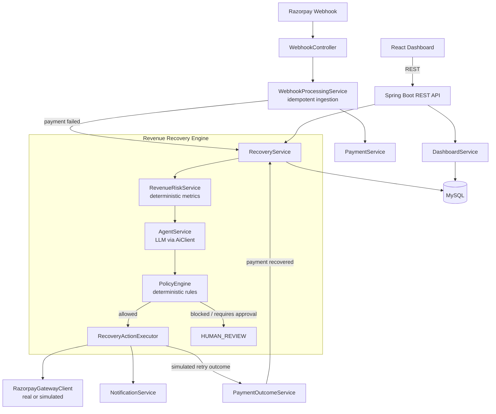

# ReviveAI

**Recover revenue before it becomes lost revenue.**

An AI-powered Revenue Recovery Agent for the Razorpay Buildathon. ReviveAI detects revenue at risk from failed
payments and subscription renewals, calculates deterministic decision metrics, gets a structured recommendation
from an AI agent, validates that recommendation through a deterministic Policy Engine, executes the approved
action, and measures the outcome.

> **AI recommends. Policy controls. Backend executes. Metrics measure.**

---

## Problem

Businesses lose revenue silently through failed payments, subscription renewal failures, and abandoned checkouts.
Most of that revenue is recoverable — a well-timed retry, a reminder, or a modest discount often closes the gap —
but doing this manually doesn't scale, and doing it with an unsupervised AI is a financial-safety risk.

## Solution

ReviveAI treats revenue recovery as a four-stage pipeline, with a hard separation between *deciding* and
*controlling*:

1. **Decision Metrics** (deterministic) — revenue at risk, customer lifetime value, payment success rate,
   recovery probability, expected recovery value, and priority, all computed from real data with a documented,
   explainable formula. Never estimated by the LLM.
2. **AI Agent** — receives the metrics as read-only, authoritative context and recommends exactly one action from
   a fixed set. Its raw output is never trusted directly — every field is validated before use.
3. **Policy Engine** (deterministic) — validates the AI's recommendation against merchant-configured safety
   limits (discount caps, retry limits, high-value-payment approval, refund restrictions) and either allows it,
   blocks it, or routes it to a human.
4. **Recovery Action Executor** — carries out only what the Policy Engine approved, via a real Razorpay
   integration or a clearly-labeled simulation adapter, and reports back what actually happened.

## Architecture



## Core Concepts

| Concept | Owner | Nature |
|---|---|---|
| Decision Metrics | `RevenueRiskService` | Deterministic arithmetic — revenue at risk, CLV, success rate, recovery probability (documented MVP heuristic, not ML), expected value, priority |
| AI Agent | `AgentService` + `AiClient` | Structured JSON recommendation from one of 6 fixed actions; every field validated, invalid output falls back to `ESCALATE_TO_HUMAN` |
| Policy Engine | `PolicyEngine` + `MerchantPolicy` | Discount cap, retry cap, high-value approval, refund-always-human — pure rules, zero AI involvement |
| Recovery Execution | `RecoveryActionExecutor` | Real Razorpay Payment Links API or a clearly-labeled simulated adapter — never fakes a real response |

## Tech Stack

- **Backend:** Java 21, Spring Boot 3, Spring Data JPA, Spring Scheduling, Maven
- **Database:** MySQL 8
- **Frontend:** React 18, Vite, Tailwind CSS, Recharts
- **AI:** Anthropic Messages API, behind a single `AiClient` interface
- **Payments:** Razorpay APIs and Webhooks
- **Docs:** Springdoc OpenAPI / Swagger UI
- **Deployment:** Docker, Docker Compose

## Features

- Idempotent Razorpay webhook ingestion (unique `external_event_id`, safe redelivery handling)
- Six deterministic decision metrics with a documented, inspectable recovery-probability heuristic
- LLM-backed recommendation across a fixed 6-action set, with full response validation and safe fallback
- Deterministic Policy Engine: discount limits, retry limits, high-value human approval, refund restrictions
- Six recovery actions, two of them (`RETRY_PAYMENT`, `SEND_REMINDER`) delayed via Spring Scheduling, with a
  demo-mode second-scale override so the full flow completes in under a minute
- Full REST API with pagination, filtering, and Swagger UI
- React dashboard: revenue overview, recovery queue, revenue-leakage breakdown, agent activity feed, and a full
  case-detail view with AI reasoning, a stamped policy verdict, execution result, and timeline
- Human-in-the-loop approve/reject for any case the Policy Engine routes to review
- Realistic seed data generated through the real production pipeline (not hand-typed numbers)

## Setup

### Prerequisites
Java 21, Maven, Node 20+, MySQL 8 (or Docker), a Razorpay test account (optional — simulation adapters cover the
full demo without one), an Anthropic API key (optional — the AI falls back safely to `ESCALATE_TO_HUMAN` without
one, so the app still runs).

### Option A — Docker Compose (recommended)

```bash
cp .env.example .env
# edit .env if you have real Razorpay/LLM credentials; safe to leave blank for a full demo
docker compose up --build
```

- Frontend: http://localhost:5173
- Backend API: http://localhost:8080/api
- Swagger UI: http://localhost:8080/swagger-ui.html

### Option B — Run locally

```bash
# 1. Database
docker compose up -d mysql   # or point DATABASE_URL at your own MySQL instance

# 2. Backend
cd backend
cp ../.env.example ../.env   # then export the vars, or configure your IDE run config
mvn spring-boot:run

# 3. Frontend
cd frontend
cp .env.example .env
npm install
npm run dev
```

### Environment Variables

See `.env.example` at the project root for the full list. Nothing is required to run the full demo — Razorpay
and LLM credentials are optional; leaving them blank activates the simulated payment-gateway adapter and the
safe AI fallback, respectively.

## Demo

On first boot with `DEMO_MODE=true` (the default), `DemoDataSeeder` populates 21 customers, ~30 payments, 2
subscriptions, and 13 fully-processed recovery cases — computed by the **real** `RevenueRiskService`,
`PolicyEngine`, and `RecoveryActionExecutor`, not hand-typed numbers. Five scenarios are worth looking at
specifically:

1. **High-priority successful recovery** (Rahul Sharma, ₹4,999) — strong payment history, recoverable failure
   reason → `RETRY_PAYMENT` allowed automatically → a retry is scheduled and (weighted by the case's own
   recovery probability) resolves to `RECOVERED` roughly 30 seconds after boot. Watch the dashboard's Revenue
   Recovered figure move on its own.
2. **The policy-blocked demo moment** (Ananya Verma, ₹9,999) — AI recommends a 20% discount, merchant policy
   caps discounts at 10% → `BLOCKED` → the case sits in `HUMAN_REVIEW` with live Approve/Reject buttons on its
   detail page. This is the single most important thing to show: the AI does not get the final word.
3. **High-value requires-approval** (Karan Mehta, ₹65,000) — a plausible retry recommendation, but the amount
   exceeds the high-value threshold → `REQUIRES_APPROVAL`, distinct from an outright block.
4. **Subscription renewal failure** (Priya Nair) — the secondary revenue-risk source, processed through
   `RevenueRiskService.calculateForSubscription`.
5. **Checkout abandonment** (Deepak Joshi) — the deferred secondary flow, seeded manually since no live
   `CHECKOUT_ABANDONED` event path exists yet (see Future Improvements).

To trigger a live webhook yourself:

```bash
curl -X POST http://localhost:8080/api/webhooks/razorpay \
  -H "Content-Type: application/json" \
  -d '{
    "event": "payment.failed",
    "payload": { "payment": { "entity": {
      "id": "pay_manual_test_1",
      "amount": 499900,
      "currency": "INR",
      "status": "failed",
      "email": "test.customer@example.com",
      "error_description": "Insufficient funds"
    }}}
  }'
```
(No `X-Razorpay-Signature` header is required when `RAZORPAY_WEBHOOK_SECRET` is unset — signature verification
is skipped with a logged warning, so you can exercise the full pipeline without real Razorpay credentials.)

## API

Full interactive reference at `/swagger-ui.html`. Summary:

| Method | Path | Purpose |
|---|---|---|
| POST | `/api/webhooks/razorpay` | Idempotent Razorpay webhook ingestion |
| GET | `/api/dashboard/summary` | Revenue at risk / recoverable / recovered / recovery rate |
| GET | `/api/dashboard/revenue-risk` | Breakdown by failed payments / abandonment / subscriptions |
| GET | `/api/dashboard/agent-activity` | Paginated AI + policy decision feed |
| GET | `/api/recovery-cases` | List, filterable by `status` and `priority` |
| GET | `/api/recovery-cases/{id}` | Full case detail |
| POST | `/api/recovery-cases/{id}/analyze` | Re-run metrics → AI → policy |
| POST | `/api/recovery-cases/{id}/execute` | Re-trigger execution |
| POST | `/api/recovery-cases/{id}/approve` | Approve a `HUMAN_REVIEW` case |
| POST | `/api/recovery-cases/{id}/reject` | Reject a `HUMAN_REVIEW` case |
| GET | `/api/customers/{id}` | Customer profile |
| GET | `/api/payments` | Paginated payment list |

## Engineering Highlights

- **Webhook idempotency**: `webhook_events.external_event_id` is uniquely constrained; duplicate deliveries are
  detected before any state mutation, inside the same transaction as ingestion.
- **Deterministic decision metrics**: every number the AI sees is computed by plain arithmetic in
  `RevenueRiskService`, with a `reasoningTrace` list documenting exactly which signals fired.
- **AI structured output validation**: `AgentService` never trusts raw LLM output — action must be one of 6
  enum values, confidence in `[0,1]`, discount only where relevant, everything else falls back to
  `ESCALATE_TO_HUMAN`.
- **Policy-based safety**: `PolicyEngine` has zero dependency on the AI layer and is exhaustively unit-tested in
  isolation — discount caps, retry caps, and high-value approval all have dedicated tests.
- **Transaction handling**: webhook ingestion, payment/customer updates, and (from Day 6 onward)
  RecoveryCase creation all happen inside one `@Transactional` boundary.
- **Modular monolith**: no microservices, no Kafka, no Redis — six cleanly-separated layers
  (`controller` → `service` → `ai`/`policy`/`recovery` → `repository`) in one deployable JAR.
- **Asynchronous/delayed recovery actions**: `RETRY_PAYMENT` and `SEND_REMINDER` run through Spring's
  `TaskScheduler`, with demo-mode seconds standing in for production-mode hours via one config flag.
- **Acyclic dependency graph, verified by hand**: `PaymentOutcomeService` exists specifically to prevent a
  circular bean dependency between `RecoveryService` and `RecoveryActionExecutor` — documented in its own
  Javadoc.

## Future Improvements

- ML-based recovery-probability prediction, replacing the current documented MVP heuristic
- Kafka/event streaming for webhook ingestion at scale
- Redis for caching and distributed rate limiting
- Distributed background workers instead of in-process `TaskScheduler`
- A/B experimentation across recovery strategies
- Reinforcement-learning-based action selection
- Multi-agent workflows (e.g. a separate negotiation agent for discount sizing)
- A live `CHECKOUT_ABANDONED` event source and full subscription-renewal webhook orchestration (both currently
  seeded manually rather than driven by a live event path)
- Flyway/Liquibase migrations in place of `ddl-auto: update`
- A searchable customer directory (`GET /api/customers` currently only supports single-ID lookup)

---

*Built for the Razorpay Buildathon. Not affiliated with or endorsed by Razorpay.*
